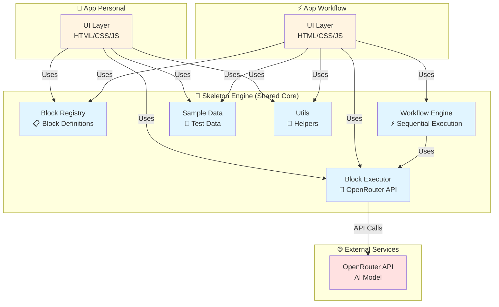

# 🧩 PromptBlocks
> **A reusable skeleton framework for building AI-powered applications**

PromptBlocks demonstrates the Skeleton Crew pattern: one production-ready foundation powering multiple applications with zero code duplication.


**🎯 Hackathon Submission**: This project is submitted to the [Kiro Hackathon - Skeleton Crew Category](https://kiroween.devpost.com/?_gl=1*12nunb4*_gcl_au*NjYyMjM3OTg0LjE3NTg4MjA4MjY.*_ga*MjcwNzE4NjM3LjE3NTg4MjA4Mjc.*_ga_0YHJK3Y10M*czE3NjQ5NDAyOTIkbzExNCRnMSR0MTc2NDk0MTE2NCRqMiRsMCRoMA..)


---

## 🎯 The Problem

Every time developers build an AI application, they rebuild the same things:
- 🔌 AI API integration and authentication
- ⚠️ Error handling and retry logic  
- ✅ Input validation and output formatting
- 🔄 Workflow execution and state management

**This wastes 20+ hours per project.**

## ✨ The Solution

PromptBlocks provides a **production-ready skeleton engine** that handles all the complexity once. Developers can then build unlimited applications as thin UI layers on top.

**🎪 Proof:** We built two completely different applications from the same foundation:
- **📝 Single-Block Executor**: Function pattern (one input → one output)
- **⚡ Workflow Builder**: Pipeline pattern (chained transformations)

Both apps share 100% of their core logic. **Zero duplication.**

---

## 🏗️ The Skeleton Crew Pattern

### 🎯 Core Principle
All applications share the same skeleton engine. Apps contain **only UI logic**—no AI integration, no error handling, no business logic.

### 📐 Architecture Diagram



**Key Insight**: Both applications import and use the exact same skeleton files. Zero code duplication = 100% reusability.

### 💎 Benefits
- ✅ **Zero Duplication**: Write once, reuse everywhere
- ⚡ **Rapid Development**: Build new apps in hours, not weeks
- 🎯 **Consistent Behavior**: All apps work the same way
- 🔧 **Easy Maintenance**: Fix bugs once, all apps benefit
- 🚀 **Production Ready**: Error handling, retry logic, validation built-in

### 🔌 Extensibility
Adding a new transformation block takes 5 minutes:
1. Add block definition to `skeleton/block_registry.js`
2. Add sample data to `skeleton/sample_data.js`
3. ✨ Done—both apps can now use it

### 📦 Available Blocks

| Block | Description |
|-------|-------------|
| 📝 **summarizeText** | Condense text to key points |
| 🎯 **extractKeyPoints** | Identify and list main ideas |
| ✍️ **improveWritingQuality** | Enhance clarity and grammar |
| 📧 **rewriteAsEmail** | Convert to professional email format |
| 🌍 **translateText** | Convert between languages |
| 📊 **convertToTable** | Structure data as markdown table |

---

## 🛠️ Technology Stack

### 🤖 AI Integration
- **Provider**: [OpenRouter](https://openrouter.ai)
- **Model**: nousresearch/hermes-3-llama-3.1-70b
- **Features**: Automatic retry with exponential backoff, error handling, timeout management

### 🏛️ Architecture
- **Pattern**: Skeleton Crew (shared core, thin UI layers)
- **Languages**: JavaScript (ES6+), HTML5, CSS3
- **Browser**: Any modern browser with ES6 support


---

## 🤖 Development with Kiro

This project was built using **Kiro's advanced features** to demonstrate AI-assisted development:

### 📋 Spec-Driven Development
Complete specification in `.kiro/specs/promptblocks/`:
- 📄 `requirements.md` - EARS-compliant requirements with user stories
- 🎨 `design.md` - Architecture and component design
- ✅ `tasks.md` - Implementation task breakdown

### 🎯 Steering Documents
Development guidelines in `.kiro/steering/promptblocks-project.md`:
- 🏗️ Skeleton Crew pattern enforcement
- 📁 Code organization rules
- 🔄 Consistency guidelines
- 🚫 Anti-duplication checks

### 🪝 Agent Hooks
Automated validation in `.kiro/hooks/`:
- ✅ `validate-blocks.json` - Validates block registry on save
- 🔍 `check-skeleton-consistency.json` - Ensures no code duplication

**Result**: Kiro enabled rapid development of a clean, well-architected system with zero code duplication between applications.

---

## 📁 Project Structure

```
promptblocks/
├── 🦴 skeleton/              # Shared engine (reusable core)
│   ├── block_registry.js     # 6 transformation blocks
│   ├── block_executor.js     # AI API integration
│   ├── workflow_engine.js    # Sequential execution
│   ├── sample_data.js        # Test data
│   └── utils.js              # Validation & formatting
│
├── 📝 app_personal/          # Single-block executor app
│   ├── landing.html          # App landing page
│   ├── index.html            # Application
│   ├── app.js                # UI logic only
│   └── style.css
│
├── ⚡ app_workflow/          # Workflow builder app
│   ├── landing.html          # App landing page
│   ├── index.html            # Application
│   ├── app.js                # UI logic only
│   └── style.css
│
├── 🤖 .kiro/                 # Kiro development artifacts
│   ├── specs/                # Requirements, design, tasks
│   ├── steering/             # Development guidelines
│   └── hooks/                # Agent hooks for automation
│
├── ⚙️ config.example.js      # API key template
```

---

## 🧪 Testing Guide (for Judges)

### 🚀 Quick Start
```bash
# Clone the repository
git clone https://github.com/Adamderbel/Prompt-Blocks.git
cd promptblocks

# Set up API key
cp config.example.js config.js
# Edit config.js and add your OpenRouter API key
```

### 2️⃣ Try the Applications

**Run locally**
1. Get a free API key from [OpenRouter](https://openrouter.ai/keys)
2. Add your API key to `config.js`:
   ```javascript
   var OPENROUTER_API_KEY = "your-key-here";
   ```
3. Open `app_personal/index.html` for Single-Block Executor
4. Open `app_workflow/index.html` for Workflow Builder

### 3️⃣ Test the Apps

**📝 Single-Block Executor:**
1. Select a block from the dropdown (try `improveWritingQuality`)
2. Click "Try Sample Data" to load example text
3. Click "Transform"
4. See the result and click "Copy to Clipboard"

**⚡ Workflow Builder:**
1. Select multiple blocks by checking boxes (try `improveWritingQuality` + `rewriteAsEmail`)
2. OR select a pre-built workflow from the dropdown
3. Enter text or use the sample workflow's data
4. Click "Run Workflow"
5. See step-by-step results
6. Try "Save Workflow", "Copy All", or "Export Results"

### 4️⃣ Verify the Skeleton Pattern

To verify zero code duplication:
1. 📂 Check `skeleton/` folder - all core logic is here
2. 🎨 Check `app_personal/app.js` and `app_workflow/app.js` - only UI logic
3. 🔗 Both apps import the same skeleton files
4. ✅ No duplication of AI integration, error handling, or business logic

---

### 🎨 Customization

**Add a new block:**
```javascript
// skeleton/block_registry.js
{
  id: 'myNewBlock',
  name: 'My New Block',
  description: 'What it does',
  prompt: 'System prompt for AI',
  sampleInput: 'Example text'
}

// skeleton/sample_data.js
'myNewBlock': 'Sample text for testing...'
```

**Change AI model:**
```javascript
// skeleton/block_executor.js
const MODEL = 'provider/model-name:free';
```

---

## 📄 License

MIT License - See [LICENSE](LICENSE) file for details.

---

## 🙋 Questions or Issues?

Feel free to reach out or open an issue in the repository!

---

<div align="center">

**🧩 PromptBlocks: One skeleton. Unlimited applications.**

Built with ❤️ using [Kiro](https://kiro.ai) for the Skeleton Crew Hackathon

</div>
